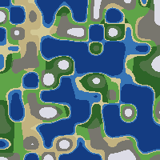
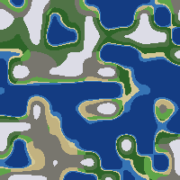
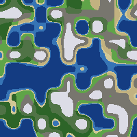

# Procedural Planet Generation

Randomised top-down terrain maps rendered as PNG images. Each run generates a unique world from a random seed using hand-rolled value noise and a two-axis biome model.

---

## Examples

Three independent runs:

| | | |
|:---:|:---:|:---:|
|  |  |  |

---

## Quick start

```sh
cargo run
```

Writes `terrain.png` to the working directory. Re-run for a new world.

---

## How it works

**Noise** — each pixel samples two independent value noise fields. The noise is built from scratch: integer grid corners are hashed with a multiply-xor sequence, then bilinearly interpolated using a smoothstep fade (`3t² − 2t³`). No external noise library.

**Two fields, not one** — height and moisture use different seeds and different spatial frequencies. This means a dry desert can sit at the same elevation as a dense forest, rather than biomes being locked to altitude bands.

**Biome lookup** — once height and moisture are known for a pixel, a simple threshold table maps them to a color:

| Biome | Height | Moisture |
|---|---|---|
| Deep ocean | < 0.38 | — |
| Shallow ocean | 0.38 – 0.44 | — |
| Beach | 0.44 – 0.475 | — |
| Desert | 0.475 – 0.62 | < 0.32 |
| Grassland | 0.475 – 0.62 | 0.32 – 0.58 |
| Forest | 0.475 – 0.62 | > 0.58 |
| Highland rock | 0.62 – 0.78 | ≤ 0.55 |
| Wet highland | 0.62 – 0.78 | > 0.55 |
| Snow peaks | > 0.78 | — |

---

## Versions

| Version | What changed | Run |
|---|---|---|
| v1 | Purely random tile per cell — no noise | `cargo run --bin v01_random` |
| v2 | Value noise height field, ASCII terminal output | — |
| v2.1 | PNG export via the `image` crate | — |
| v2.2 | Independent moisture field, full biome palette | `cargo run` |

---

## Requirements

- [Rust](https://rustup.rs/) (edition 2024)
